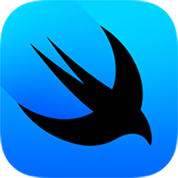

# DALL·E 2 한국어

 

<b>[ DALL·E 2 한국어 ]</b>
 
DALL·E 2의 프롬프트는 영어 외 다른 언어는 지원하지 않아,  
사용자의 프롬프트를 번역을 거쳐 DALL·E 2에 프롬프트를 전달하는 방식의 프로젝트  
(DALL·E 3의 경우 모든 언어 자체 지원)
 
 

제작 기간: 2023년 12월
 
 

## Technology Stack

<table>
  <tr>
    <td align="center">
      
    </td>
  </tr>
  <tr>
    <td align="center"><b>SwiftUI</b></td>
  </tr>
</table>

## APIs

<table>
  <tr>
    <td align="center">
      
    </td>
    <td align="center">
      
    </td>
    <td align="center">
      
    </td>
  </tr>
  <tr>
    <td align="center"><b>ChatGPT 3.5</b></td>
    <td align="center"><b>DALL·E 2</b></td>
    <td align="center"><b>Papago(지원 종료)</b></td>
  </tr>
</table>

- 번역 API는 지원 종료된 Papago API 대신 ChatGPT API로 변경

## Fonts

